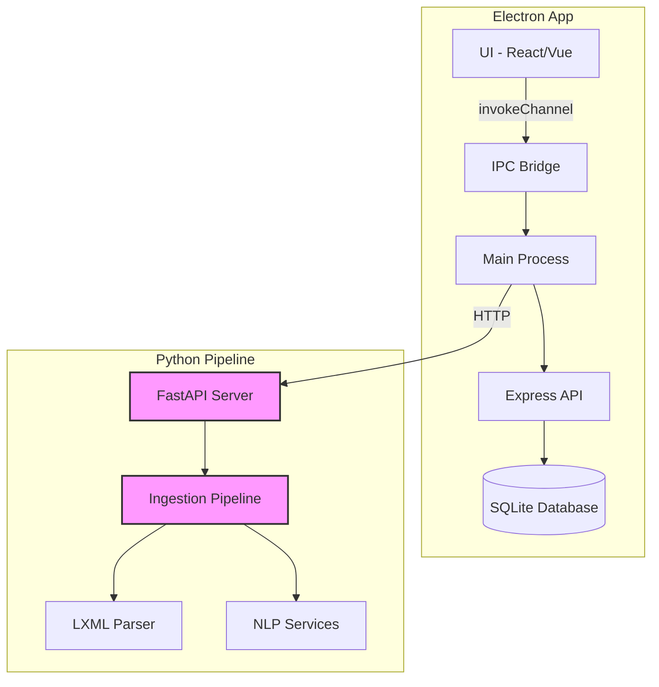
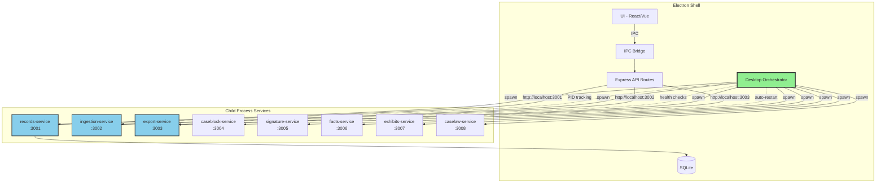
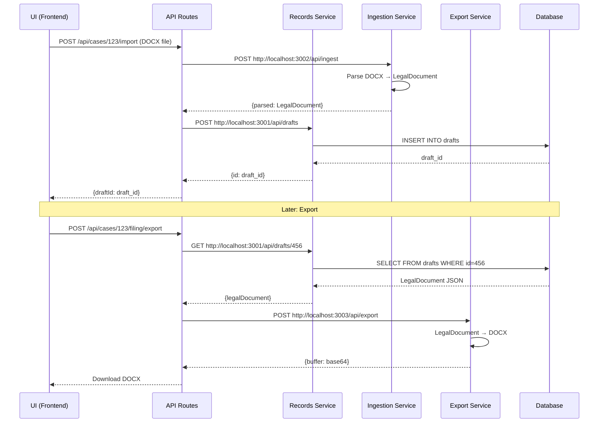

# FACTSWAY Backend - Complete Architecture Map

**Generated:** December 26, 2025
**Purpose:** Comprehensive current vs target architecture for drift prevention
**Backend Path:** /Users/alexcruz/Documents/factsway-backend

---

## Table of Contents

1. [Part 1: Current State](#part-1-current-state)
2. [Part 2: Target State](#part-2-target-state)
3. [Part 3: Comparison & Tracking](#part-3-comparison--tracking)

---

# Part 1: Current State

# FACTSWAY Backend - Current Architecture Map
**Generated:**
Fri Dec 26 02:42:14 CST 2025
**Purpose:** Complete inventory for drift prevention

---

## 1. Directory Structure (Summary)

  .
  ARCH_SNAPSHOT
  factsway-ingestion
  factsway-ingestion/ingestion_engine
  factsway-ingestion/ingestion_engine/docx
  factsway-ingestion/ingestion_engine/extraction
  factsway-ingestion/ingestion_engine/models
  factsway-ingestion/ingestion_engine/passes
  factsway-ingestion/ingestion_engine/pdf
  factsway-ingestion/ingestion_engine/services
  factsway-ingestion/ingestion_test
  factsway-ingestion/scripts
  migrations
  scripts
  scripts/db
  src
  src/api
  src/api/middleware
  src/api/routes
  src/api/utils
  src/clerks
  src/clerks/caseblock
  src/clerks/drafting
  src/clerks/exhibits
  src/clerks/facts
  src/clerks/filing
  src/clerks/formatting
  src/clerks/records
  src/clerks/signature
  src/ipc
  src/ipc/schema
  src/lib
  src/logging
  src/main
  src/main/audit
  src/main/auth
  src/main/db
  src/main/domain
  src/main/drafting
  src/main/export
  src/main/handlers
  src/main/ingestion
  src/main/intake
  src/main/ipc
  src/main/orchestrator
  src/main/records
  src/main/security
  src/main/services
  src/main/telemetry
  src/main/validation
  src/main/workers
  src/monitoring
  src/security
  src/shared
  src/shared/caseblock
  src/shared/config
  src/shared/drafting
  src/shared/formatting
  src/shared/ipc
  src/shared/motion
  src/shared/parser
  src/shared/render
  src/shared/render-logic
  src/shared/schema
  src/shared/signatureblock
  src/shared/style
  src/shared/types
  src/shared/utils
  src/tagging
  src/types
  src/utils
  src/workers
  vault
  vault/01KD44EPP80GFJP30Y752ZPET6
  vault/01KD44EPP80GFJP30Y752ZPET6/documents

---

## 2. File Count by Type


### TypeScript/JavaScript Files
264

### Python Files
37

### Configuration Files
5

### Key Files Present

- Main: src/main/
  - errors.ts
  - types.ts

- API Routes: src/api/routes/
  - admin.ts
  - caseblock.ts
  - cases.ts
  - debug.ts
  - drafting.ts
  - exhibitLinks.ts
  - exhibits.ts
  - filing.ts
  - formatting.ts
  - gemini.ts
  - index.ts
  - llm-debug.ts
  - llm.ts
  - records.ts
  - signature.ts
  - wizard.ts

- Handlers: src/main/handlers/
  - index.ts


# Component Classification Matrix

**Legend:**
- 🟢 KEEP - Core backend, do not modify
- 🔴 REMOVE - Old ingestion pipeline, delete during cleanup
- 🟡 REFACTOR - Needs updates for new architecture
- 🔵 NEW - To be created per Runbook 0

---

## TypeScript Core Components

| Path | Component | Purpose | Fate |
|------|-----------|---------|------|
| `src/main/errors.ts` | Main Process |  | 🟢 KEEP |
| `src/main/types.ts` | Main Process |  | 🟢 KEEP |

## IPC Handlers

| Path | Handler | Channel | Fate |
|------|---------|---------|------|
| `src/main/handlers/drafting/index.ts` | IPC Handler | Unknown channels | 🟢 KEEP |
| `src/main/handlers/drafting/importDocx.ts` | IPC Handler | Unknown channels | 🟢 KEEP |
| `src/main/handlers/renderer/index.ts` | IPC Handler | Unknown channels | 🟢 KEEP |
| `src/main/handlers/records/index.ts` | IPC Handler | Unknown channels | 🟢 KEEP |
| `src/main/handlers/llm/index.ts` | IPC Handler | Unknown channels | 🟢 KEEP |
| `src/main/handlers/app/index.ts` | IPC Handler | Unknown channels | 🟢 KEEP |
| `src/main/handlers/gemini/index.ts` | IPC Handler | Unknown channels | 🟢 KEEP |
| `src/main/handlers/security/index.ts` | IPC Handler | Unknown channels | 🟢 KEEP |
| `src/main/handlers/auth/index.ts` | IPC Handler | Unknown channels | 🟢 KEEP |
| `src/main/handlers/admin/index.ts` | IPC Handler | Unknown channels | 🟢 KEEP |
| `src/main/handlers/cases/index.ts` | IPC Handler | Unknown channels | 🟢 KEEP |
| `src/main/handlers/pdf/index.ts` | IPC Handler | Unknown channels | 🟢 KEEP |
| `src/main/handlers/style/index.ts` | IPC Handler | style:pick-and-extract | 🟢 KEEP |
| `src/main/handlers/motion/index.ts` | IPC Handler | Unknown channels | 🟢 KEEP |
| `src/main/handlers/exports/index.ts` | IPC Handler | Unknown channels | 🟢 KEEP |
| `src/main/handlers/dialog/index.ts` | IPC Handler | Unknown channels | 🟢 KEEP |
| `src/main/handlers/exhibits/index.ts` | IPC Handler | Unknown channels | 🟢 KEEP |
| `src/main/handlers/authoring/index.ts` | IPC Handler | Unknown channels | 🟢 KEEP |
| `src/main/handlers/audit/index.ts` | IPC Handler | Unknown channels | 🟢 KEEP |
| `src/main/handlers/formatting/index.ts` | IPC Handler | Unknown channels | 🟢 KEEP |
| `src/main/handlers/diagnostics/index.ts` | IPC Handler | Unknown channels | 🟢 KEEP |
| `src/main/handlers/citations/index.ts` | IPC Handler | Unknown channels | 🟢 KEEP |
| `src/main/handlers/exhibitLinks/index.ts` | IPC Handler | Unknown channels | 🟢 KEEP |
| `src/main/handlers/index.ts` | IPC Handler | Unknown channels | 🟢 KEEP |
| `src/main/handlers/pleadings/index.ts` | IPC Handler | Unknown channels | 🟢 KEEP |
| `src/main/handlers/filing/exportHandler.ts` | IPC Handler | Unknown channels | 🟢 KEEP |
| `src/main/handlers/filing/index.ts` | IPC Handler | Unknown channels | 🟢 KEEP |
| `src/main/handlers/monitoring/index.ts` | IPC Handler | Unknown channels | 🟢 KEEP |
| `src/main/handlers/facts/index.ts` | IPC Handler | Unknown channels | 🟢 KEEP |
| `src/main/handlers/signatureblock/index.ts` | IPC Handler | Unknown channels | 🟢 KEEP |
| `src/main/handlers/signatureblock/clerkHandlers.ts` | IPC Handler | Unknown channels | 🟢 KEEP |
| `src/main/handlers/metadata/index.ts` | IPC Handler | Unknown channels | 🟢 KEEP |
| `src/main/handlers/orchestrator/index.ts` | IPC Handler | Unknown channels | 🟢 KEEP |
| `src/main/handlers/proposals/index.ts` | IPC Handler | Unknown channels | 🟢 KEEP |
| `src/main/handlers/caseblock/index.ts` | IPC Handler | Unknown channels | 🟢 KEEP |
| `src/main/handlers/caseblock/clerkHandlers.ts` | IPC Handler | Unknown channels | 🟢 KEEP |

## API Routes

| Path | Route | Method | Fate |
|------|-------|--------|------|
| `src/api/routes/llm-debug.ts` | API Route | /llm-debug/* | 🟢 KEEP |

## Python Ingestion Pipeline

| Path | Component | Purpose | Fate |
|------|-----------|---------|------|
| `factsway-ingestion/ingestion_engine/docx/pipeline_v2/pipeline.py` | Python Pipeline | DOCX ingestion (OLD) | 🔴 REMOVE |
| `factsway-ingestion/ingestion_engine/docx/pipeline_v2/extended_pipeline.py` | Python Pipeline | Extended pipeline (OLD) | 🔴 REMOVE |
| `factsway-ingestion/ingestion_engine/services/citation_service.py` | Python Service | NLP/Citation service | 🟡 REFACTOR - Extract for new microservices |
| `factsway-ingestion/ingestion_engine/services/sentence_service.py` | Python Service | NLP/Citation service | 🟡 REFACTOR - Extract for new microservices |
| `factsway-ingestion/ingestion_engine/services/__init__.py` | Python Service | NLP/Citation service | 🟡 REFACTOR - Extract for new microservices |

## Database & Storage

| Path | Component | Purpose | Fate |
|------|-----------|---------|------|
| `migrations/` | Database Schema | 1 migration files | 🟢 KEEP |
| `src/main/services/signatureblock/storageService.ts` | Storage Service | Data persistence | 🟢 KEEP |
| `src/main/services/caseblock/storageService.ts` | Storage Service | Data persistence | 🟢 KEEP |


# IPC Channel Complete Inventory

**Purpose:** Map all IPC channels to prevent breaking UI integration

---

## Registered Channels (ipcMain.handle)

| Channel Name | Handler File | Line | Status |
|--------------|--------------|------|--------|
| `style:pick-and-extract` | `src/main/handlers/style/index.ts` | 27 | 🟢 ACTIVE |

## Invoked Channels (invokeChannel)

| Channel Name | Caller File | Line | Target |
|--------------|-------------|------|--------|
| `caseblock:update` | `src/api/routes/caseblock.ts` | 187 | ❌ NO HANDLER |
| `caseblock:set-default` | `src/api/routes/caseblock.ts` | 214 | ❌ NO HANDLER |
| `caseblock:update-style` | `src/api/routes/caseblock.ts` | 922 | ❌ NO HANDLER |
| `caseblock:update-content-policy` | `src/api/routes/caseblock.ts` | 967 | ❌ NO HANDLER |
| `admin:update-parties` | `src/api/routes/caseblock.ts` | 1162 | ❌ NO HANDLER |
| `admin:update-court` | `src/api/routes/caseblock.ts` | 1170 | ❌ NO HANDLER |
| `admin:update-jurisdiction` | `src/api/routes/caseblock.ts` | 1179 | ❌ NO HANDLER |
| `drafting:delete-draft` | `src/api/routes/drafting.ts` | 202 | ❌ NO HANDLER |
| `drafting:import-docx-buffer` | `src/api/routes/drafting.ts` | 226 | ❌ NO HANDLER |
| `signature:update` | `src/api/routes/signature.ts` | 208 | ❌ NO HANDLER |
| `signature:set-default` | `src/api/routes/signature.ts` | 511 | ❌ NO HANDLER |
| `exhibits:delete` | `src/api/routes/exhibits.ts` | 184 | ❌ NO HANDLER |
| `admin:set-metadata` | `src/api/routes/admin.ts` | 59 | ❌ NO HANDLER |
| `admin:update-parties` | `src/api/routes/admin.ts` | 91 | ❌ NO HANDLER |
| `admin:update-court` | `src/api/routes/admin.ts` | 119 | ❌ NO HANDLER |
| `admin:update-jurisdiction` | `src/api/routes/admin.ts` | 147 | ❌ NO HANDLER |
| `admin:update-signers` | `src/api/routes/admin.ts` | 175 | ❌ NO HANDLER |
| `admin:update-meta` | `src/api/routes/admin.ts` | 203 | ❌ NO HANDLER |
| `formatting:update` | `src/api/routes/formatting.ts` | 99 | ❌ NO HANDLER |
| `formatting:set-default` | `src/api/routes/formatting.ts` | 126 | ❌ NO HANDLER |
| `formatting:extract-styles` | `src/api/routes/formatting.ts` | 179 | ❌ NO HANDLER |
| `exhibitLinks:delete` | `src/api/routes/exhibitLinks.ts` | 138 | ❌ NO HANDLER |


# API Route Complete Inventory

**Purpose:** Map all REST API endpoints

---

## Express Routes

| Method | Path | Handler File | Line | Auth Required |
|--------|------|--------------|------|---------------|
| GET | `/summary` | `src/api/routes/llm-debug.ts` | 42 | 🔓 NO |
| GET | `/tokens` | `src/api/routes/llm-debug.ts` | 68 | 🔓 NO |
| GET | `/errors` | `src/api/routes/llm-debug.ts` | 95 | 🔓 NO |
| GET | `/compliance` | `src/api/routes/llm-debug.ts` | 148 | 🔓 NO |
| GET | `/calls` | `src/api/routes/llm-debug.ts` | 192 | 🔓 NO |
| POST | `/dump` | `src/api/routes/llm-debug.ts` | 239 | 🔓 NO |
| DELETE | `/clear` | `src/api/routes/llm-debug.ts` | 282 | 🔓 NO |
| GET | `/health` | `src/api/routes/llm-debug.ts` | 308 | 🔓 NO |
| GET | `/guardrails` | `src/api/routes/llm-debug.ts` | 379 | 🔓 NO |
| POST | `/guardrails/reset` | `src/api/routes/llm-debug.ts` | 435 | 🔓 NO |

## Python FastAPI Routes

| Method | Path | File | Status |
|--------|------|------|--------|


# Backend Dependency Graph

**Purpose:** Map import relationships to prevent breaking changes

---

## TypeScript Dependencies

### Most Imported Files (Hub Files)

| File | Import Count | Risk Level |
|------|--------------|------------|
| `src/shared/types/legal-document.types.ts` | 10 | 🟢 LOW |
| `src/shared/ids.ts` | 37 | 🔴 HIGH - Critical Hub |
| `src/shared/render/models.ts` | 12 | 🟡 MEDIUM - Important |
| `src/shared/logger.ts` | 39 | 🔴 HIGH - Critical Hub |
| `src/shared/formatting/extendedSchema.ts` | 6 | 🟢 LOW |
| `src/shared/signatureblock/schema.ts` | 8 | 🟢 LOW |
| `src/shared/caseblock/schema.ts` | 16 | 🟡 MEDIUM - Important |
| `src/logging/structured.ts` | 10 | 🟢 LOW |

### External Dependencies (package.json)

```json
{
  "@google/generative-ai": "^0.11.3",
  "@xmldom/xmldom": "^0.8.11",
  "canvas": "^3.2.0",
  "date-fns": "^4.1.0",
  "dotenv": "^17.2.3",
  "electron-squirrel-startup": "^1.0.1",
  "lodash-es": "^4.17.21",
  "lodash.debounce": "^4.0.8",
  "mammoth": "^1.11.0",
  "node-html-parser": "^7.0.1",
  "pdf-parse": "^1.1.1",
  "pdfjs-dist": "^4.10.38",
  "puppeteer-core": "^23.0.0",
  "tesseract.js": "6.0.1",
  "ulid": "^3.0.1",
  "uuid": "^11.1.0",
  "zod": "^3.25.76"
}
```

### Python Dependencies (requirements.txt)


---

# Part 2: Target State

# FACTSWAY Backend - Target Architecture (Post-Runbook 0)

**Source:** Runbook 0, Section 16 (File Structure)
**Status:** SPECIFICATION - Not yet implemented

---

## 1. Target Directory Structure

**Based on Section 16.1: Monorepo Structure**

```
factsway-platform/                    # NEW MONOREPO ROOT
├── services/                         # 🔵 NEW - Microservices
│   ├── records-service/              # 🔵 NEW - Template, Case, Draft CRUD
│   │   ├── src/
│   │   │   ├── routes/
│   │   │   │   ├── templates.ts
│   │   │   │   ├── cases.ts
│   │   │   │   └── drafts.ts
│   │   │   ├── repositories/
│   │   │   │   ├── sqlite/          # Desktop implementation
│   │   │   │   └── postgres/        # Cloud implementation
│   │   │   ├── models/
│   │   │   └── server.ts
│   │   ├── tests/
│   │   ├── Dockerfile               # For cloud deployment
│   │   ├── package.json
│   │   └── build.js                 # pkg bundling for desktop
│   │
│   ├── ingestion-service/            # 🔵 NEW - DOCX → LegalDocument
│   │   ├── app/
│   │   │   ├── routes/
│   │   │   │   └── ingest.py
│   │   │   ├── parsers/
│   │   │   │   ├── nupunkt_parser.py
│   │   │   │   ├── section_detector.py
│   │   │   │   └── format_extractor.py
│   │   │   ├── models/
│   │   │   │   └── legal_document.py
│   │   │   └── main.py
│   │   ├── tests/
│   │   ├── Dockerfile
│   │   ├── requirements.txt
│   │   └── build.spec              # PyInstaller for desktop
│   │
│   ├── export-service/               # 🔵 NEW - LegalDocument → DOCX
│   │   ├── app/
│   │   │   ├── routes/
│   │   │   │   └── export.py
│   │   │   ├── renderers/
│   │   │   │   ├── docx_renderer.py
│   │   │   │   └── pdf_renderer.py
│   │   │   └── main.py
│   │   ├── tests/
│   │   ├── Dockerfile
│   │   └── requirements.txt
│   │
│   ├── caseblock-service/            # 🔵 NEW - Caption extraction
│   │   └── [standard Python service structure]
│   │
│   ├── signature-service/            # 🔵 NEW - Signature extraction
│   │   └── [standard Python service structure]
│   │
│   ├── facts-service/                # 🔵 NEW - Sentence registry
│   │   └── [standard Python service structure]
│   │
│   ├── exhibits-service/             # 🔵 NEW - Exhibit management
│   │   └── [standard Python service structure]
│   │
│   └── caselaw-service/              # 🔵 NEW - Citation detection
│       └── [standard Python service structure]
│
├── apps/                             # Desktop & Web apps
│   ├── desktop/                      # 🟡 REFACTOR - Current Electron app
│   │   ├── src/
│   │   │   ├── main/
│   │   │   │   ├── index.ts         # 🟢 KEEP - Electron main
│   │   │   │   ├── preload.ts       # 🟢 KEEP - IPC bridge
│   │   │   │   ├── orchestrator.ts  # 🔵 NEW - Service orchestrator
│   │   │   │   └── handlers/        # 🟢 KEEP - IPC handlers
│   │   │   ├── api/                 # 🟢 KEEP - Express API
│   │   │   │   └── routes/
│   │   │   └── services/            # 🟢 KEEP - Storage, etc.
│   │   ├── migrations/              # 🟢 KEEP - Database schema
│   │   ├── vault/                   # 🟢 KEEP - Document storage
│   │   └── package.json
│   │
│   └── web-trial/                    # 🔵 NEW - Web freemium app
│       ├── src/
│       │   └── app/
│       └── package.json
│
├── packages/                         # Shared code
│   ├── shared-types/                 # 🔵 NEW - TypeScript types
│   │   └── src/
│   │       └── legal-document.types.ts
│   │
│   └── shared-utils/                 # 🔵 NEW - Common utilities
│       └── src/
│
├── infrastructure/                   # 🔵 NEW - Deployment configs
│   ├── kubernetes/
│   │   ├── services/
│   │   └── ingress.yaml
│   │
│   └── docker-compose.yml           # For local multi-service testing
│
├── scripts/                          # 🟢 KEEP - Build scripts
│   └── setup-dev.sh
│
├── docs/                             # 🟢 KEEP - Documentation
│   └── runbooks/
│
├── package.json                      # 🟡 REFACTOR - Workspace config
├── lerna.json                        # 🔵 NEW - Monorepo management
└── tsconfig.base.json                # 🔵 NEW - Shared TS config
```

---

## 2. New Services Specification

**From Runbook 0, Section 15.2 (Core Services)**

| Service | Port | Language | Purpose | API Endpoints |
|---------|------|----------|---------|---------------|
| records-service | 3001 | TypeScript/Node | Template, Case, Draft CRUD | GET/POST/PUT/DELETE /api/{templates,cases,drafts} |
| ingestion-service | 3002 | Python/FastAPI | DOCX → LegalDocument | POST /api/ingest |
| export-service | 3003 | Python/FastAPI | LegalDocument → DOCX | POST /api/export |
| caseblock-service | 3004 | Python/FastAPI | Caption extraction | POST /api/caseblock/extract |
| signature-service | 3005 | Python/FastAPI | Signature extraction | POST /api/signature/extract |
| facts-service | 3006 | Python/FastAPI | Sentence registry | GET/POST /api/facts |
| exhibits-service | 3007 | Python/FastAPI | Exhibit management | GET/POST /api/exhibits |
| caselaw-service | 3008 | Python/FastAPI | Citation detection | POST /api/citations/detect |

---

## 3. Desktop Orchestrator

**From Runbook 0, Section 15.4 (Desktop App)**

### New Component: \`apps/desktop/src/main/orchestrator.ts\`

**Purpose:** Spawn and manage service child processes on desktop

**Key Features:**
- Spawns all 8 services as child processes (NOT Docker)
- PID tracking to prevent zombie processes
- Health check monitoring
- Auto-restart on crash
- Graceful shutdown
- Service discovery via localhost ports

**Class Structure:**
\`\`\`typescript
class DesktopOrchestrator {
  private servicePids: Map<string, number>;
  private serviceUrls: Map<string, string>;

  async startAllServices(): Promise<void>
  async stopAllServices(): Promise<void>
  async restartService(name: string): Promise<void>
  async healthCheck(name: string): Promise<boolean>
  cleanupZombies(): void
}
\`\`\`

**Environment Variables Set:**
\`\`\`bash
RECORDS_SERVICE_URL=http://localhost:3001
INGESTION_SERVICE_URL=http://localhost:3002
EXPORT_SERVICE_URL=http://localhost:3003
# ... etc for all 8 services
\`\`\`

---

## 4. Deployment Models

**From Runbook 0, Section 21**

| Model | Deployment | Services | Database | User |
|-------|------------|----------|----------|------|
| Desktop (Primary) | Child processes | All 8 as executables | SQLite local | Solo lawyers |
| Web Trial (Freemium) | Docker/K8s | ingestion, caseblock, signature only | PostgreSQL cloud | Lead generation |
| Mobile (Pro Se) | Docker/K8s | Subset for intake | PostgreSQL cloud | Self-represented |
| Enterprise (On-Premise) | Docker/K8s | All 8 in firm's cloud | PostgreSQL on-prem | Law firms |


# Service Interface Specifications

**From Runbook 0, Section 10 (API Endpoints)**

---

## Service-to-Service Communication

All services communicate via REST/JSON over HTTP.

### 1. Records Service (Port 3001)

**Base URL:** `http://localhost:3001` (desktop) or `http://records-service:3001` (cloud)

**Endpoints:**
- `GET /api/templates` - List all templates
- `POST /api/templates` - Create template
- `GET /api/templates/:id` - Get template
- `PUT /api/templates/:id` - Update template
- `DELETE /api/templates/:id` - Delete template
- (Same pattern for /api/cases and /api/drafts)

**Response Format:**
```json
{
  "success": true,
  "data": { /* resource */ }
}
```

---

### 2. Ingestion Service (Port 3002)

**Base URL:** `http://localhost:3002` (desktop) or `http://ingestion-service:3002` (cloud)

**Endpoints:**
- `POST /api/ingest` - Parse DOCX to LegalDocument

**Request:**
```
Content-Type: multipart/form-data
Body: file (binary .docx)
```

**Response:**
```json
{
  "success": true,
  "parsed": {
    "meta": { /* ... */ },
    "case_header": { /* ... */ },
    "caseblock": { /* ... */ },
    "body": { /* sections, paragraphs, sentences */ },
    "signature_block": { /* ... */ },
    "citations": [ /* ... */ ],
    "embedded_objects": [ /* ... */ ]
  }
}
```

---

### 3. Export Service (Port 3003)

**Base URL:** `http://localhost:3003` (desktop) or `http://export-service:3003` (cloud)

**Endpoints:**
- `POST /api/export` - Generate DOCX from LegalDocument
- `POST /api/export/pdf` - Generate PDF from LegalDocument

**Request:**
```json
{
  "legalDocument": { /* LegalDocument structure */ },
  "format": "docx" | "pdf"
}
```

**Response:**
```json
{
  "success": true,
  "buffer": "base64-encoded-bytes",
  "filename": "motion.docx"
}
```

---

### 4-8. Additional Services

- **CaseBlock Service (3004)** - POST /api/caseblock/extract, POST /api/caseblock/format
- **Signature Service (3005)** - POST /api/signature/extract, POST /api/signature/format
- **Facts Service (3006)** - GET/POST/PUT /api/facts, POST /api/facts/link
- **Exhibits Service (3007)** - GET/POST /api/exhibits, POST /api/exhibits/appendix
- **Caselaw Service (3008)** - POST /api/citations/detect, GET /api/citations/parallel


# Migration Plan: Current → Target

**Purpose:** Map what changes, what stays, what moves

---

## Component Migration Matrix

| Current Location | Current Status | Target Location | Migration Action | Risk |
|------------------|----------------|-----------------|------------------|------|
| `src/main/index.ts` | Electron main | `apps/desktop/src/main/index.ts` | 🟡 MOVE to monorepo | LOW |
| `src/main/preload.ts` | IPC bridge | `apps/desktop/src/main/preload.ts` | 🟡 MOVE to monorepo | LOW |
| `src/main/handlers/` | IPC handlers | `apps/desktop/src/main/handlers/` | 🟢 KEEP as-is | LOW |
| `src/api/routes/` | Express routes | `apps/desktop/src/api/routes/` | 🟢 KEEP, update service calls | MEDIUM |
| `migrations/` | Database schema | `apps/desktop/migrations/` | 🟢 KEEP as-is | LOW |
| `vault/` | Document storage | `apps/desktop/vault/` | 🟢 KEEP as-is | LOW |
| `factsway-ingestion/` | Python pipeline | `services/ingestion-service/` | 🔴 REFACTOR heavily | HIGH |
| `factsway-ingestion/app.py` | FastAPI server | DELETE | 🔴 REMOVE - replaced by service | LOW |
| N/A | Not exists | `apps/desktop/src/main/orchestrator.ts` | 🔵 CREATE NEW | HIGH |
| N/A | Not exists | `services/records-service/` | 🔵 CREATE NEW | HIGH |
| N/A | Not exists | `services/export-service/` | 🔵 CREATE NEW | HIGH |
| N/A | Not exists | `services/caseblock-service/` | 🔵 CREATE NEW | MEDIUM |
| N/A | Not exists | `services/signature-service/` | 🔵 CREATE NEW | MEDIUM |
| N/A | Not exists | `services/facts-service/` | 🔵 CREATE NEW | HIGH |
| N/A | Not exists | `services/exhibits-service/` | 🔵 CREATE NEW | MEDIUM |
| N/A | Not exists | `services/caselaw-service/` | 🔵 CREATE NEW | MEDIUM |
| N/A | Not exists | `infrastructure/` | 🔵 CREATE NEW | LOW |
| N/A | Not exists | `packages/shared-types/` | 🔵 CREATE NEW | LOW |

---

## Python Pipeline Components - Detailed Migration

**Current:** `factsway-ingestion/ingestion_engine/`

| Component | Current Path | Target Service | Migration Notes |
|-----------|--------------|----------------|-----------------|
| DOCX parsing (lxml) | `docx/pipeline_v2/pipeline.py` | `ingestion-service` | REFACTOR - Core logic reusable |
| NUPunkt sentence splitting | `docx/pipeline_v2/sentence_parser.py` | `ingestion-service` | MOVE directly |
| Format extraction | `extraction/format_extraction.py` | `ingestion-service` | MOVE directly |
| Preservation metadata | `extraction/preservation.py` | `ingestion-service` | MOVE directly |
| Citation service (eyecite) | `services/citation_service.py` | `caselaw-service` | EXTRACT to separate service |
| Sentence service (spaCy) | `services/sentence_service.py` | `ingestion-service` | KEEP in ingestion |
| Section detection | `docx/pipeline_v2/section_detector.py` | `ingestion-service` | MOVE directly |
| Zone detection | `docx/pipeline_v2/zone_detector.py` | `ingestion-service` | MOVE directly |
| FastAPI app | `app.py` | DELETE | REMOVE - Each service has own FastAPI app |

---

## Risk Assessment Summary

| Risk Level | Count | Components |
|------------|-------|------------|
| 🔴 HIGH | 5 | Orchestrator, Records service, Export service, Facts service, Ingestion refactor |
| 🟡 MEDIUM | 6 | API routes update, 4 new services (caseblock, signature, exhibits, caselaw) |
| 🟢 LOW | 7 | Electron main, handlers, database, vault, infrastructure, shared types |

**Highest Risk:** DesktopOrchestrator (entirely new, critical for desktop deployment)

**Medium Risk:** Service extraction from monolith (API routes need to call services instead of direct DB)

**Low Risk:** File moves and new directories (no logic changes)


---

# Part 3: Comparison & Tracking

# Architecture Comparison: Current vs Target

**Purpose:** Visual comparison to prevent drift during implementation

---

## Directory Structure Comparison

### Current Structure (Before)

```
factsway-backend/
├── src/                              # 🟢 Electron app (stays)
│   ├── main/                         # 🟢 Main process
│   ├── api/                          # 🟡 API routes (update calls)
│   └── services/                     # 🟢 Storage services
├── factsway-ingestion/               # 🔴 OLD pipeline (refactor)
│   ├── ingestion_engine/
│   └── app.py                        # 🔴 DELETE
├── migrations/                       # 🟢 Database (keep)
├── vault/                            # 🟢 Documents (keep)
└── package.json
```

### Target Structure (After)

```
factsway-platform/                    # 🔵 NEW monorepo
├── services/                         # 🔵 NEW microservices
│   ├── records-service/              # 🔵 NEW
│   ├── ingestion-service/            # 🔵 NEW (from old pipeline)
│   ├── export-service/               # 🔵 NEW
│   ├── caseblock-service/            # 🔵 NEW
│   ├── signature-service/            # 🔵 NEW
│   ├── facts-service/                # 🔵 NEW
│   ├── exhibits-service/             # 🔵 NEW
│   └── caselaw-service/              # 🔵 NEW
├── apps/
│   └── desktop/                      # 🟡 MOVED from src/
│       ├── src/main/                 # 🟢 Electron (keep)
│       ├── src/api/                  # 🟡 Routes (update)
│       ├── migrations/               # 🟢 Database (keep)
│       └── vault/                    # 🟢 Documents (keep)
├── packages/                         # 🔵 NEW shared code
│   ├── shared-types/
│   └── shared-utils/
└── infrastructure/                   # 🔵 NEW deployment configs
```

---

## Component Count Comparison

| Category | Current | Target | Change |
|----------|---------|--------|--------|
| TypeScript Services | 0 | 1 (records) | +1 NEW |
| Python Services | 1 (monolith) | 7 (microservices) | +6 NEW |
| Electron Components | 3 (main, preload, handlers) | 4 (+ orchestrator) | +1 NEW |
| API Route Files | ~8 | ~8 | SAME (updated calls) |
| Database Schemas | 1 (SQLite) | 1 (SQLite) | SAME |
| Deployment Targets | 1 (Desktop only) | 4 (Desktop, Web, Mobile, Enterprise) | +3 NEW |

---

## Critical Changes Summary

### 🟢 STAYS UNCHANGED (Core Backend)

**Electron App:**
- ✅ `src/main/index.ts` - Main process entry (moves to apps/desktop)
- ✅ `src/main/preload.ts` - IPC bridge (moves to apps/desktop)
- ✅ `src/main/handlers/` - All IPC handlers (moves to apps/desktop)
- ✅ Database schema in `migrations/`
- ✅ Document storage in `vault/`
- ✅ Storage services (`src/main/services/`)

**Database:**
- ✅ SQLite for desktop deployment
- ✅ All existing migrations
- ✅ Schema remains compatible

**UI Integration:**
- ✅ All IPC channels stay the same
- ✅ No breaking changes to frontend adapter

---

### 🔴 REMOVED (Old Ingestion)

**Python Monolith:**
- ❌ `factsway-ingestion/app.py` - FastAPI server (DELETE)
- ❌ Direct Python API calls from Electron (REPLACE with service calls)
- ❌ Monolithic pipeline (REFACTOR into ingestion-service)

**Reason:** Old pipeline becomes `ingestion-service`, but ingestion logic is preserved and improved.

---

### 🔵 ADDED (New Components)

**Microservices (8 total):**
1. ✨ `services/records-service/` - TypeScript/Node, port 3001
2. ✨ `services/ingestion-service/` - Python/FastAPI, port 3002
3. ✨ `services/export-service/` - Python/FastAPI, port 3003
4. ✨ `services/caseblock-service/` - Python/FastAPI, port 3004
5. ✨ `services/signature-service/` - Python/FastAPI, port 3005
6. ✨ `services/facts-service/` - Python/FastAPI, port 3006
7. ✨ `services/exhibits-service/` - Python/FastAPI, port 3007
8. ✨ `services/caselaw-service/` - Python/FastAPI, port 3008

**Desktop Orchestrator:**
- ✨ `apps/desktop/src/main/orchestrator.ts` - Spawns/manages services as child processes
- ✨ PID tracking, health checks, auto-restart
- ✨ Service discovery via environment variables

**Shared Packages:**
- ✨ `packages/shared-types/` - Common TypeScript types
- ✨ `packages/shared-utils/` - Shared utilities

**Infrastructure:**
- ✨ `infrastructure/kubernetes/` - Cloud deployment configs
- ✨ `infrastructure/docker-compose.yml` - Local testing

---

### 🟡 MODIFIED (Updated)

**API Routes:**
- 🔧 Update to call microservices instead of direct DB/Python
- 🔧 Example: `POST /api/cases/:id/filing/export` now calls `export-service:3003`
- 🔧 Service URLs injected via environment variables

**Package.json:**
- 🔧 Becomes workspace root (lerna/npm workspaces)
- 🔧 Scripts updated for monorepo
- 🔧 Dependencies moved to service-specific package.json files


# Backend Architecture Diagrams

**Purpose:** Visual representations of current vs target architecture

---

## Current Architecture (Before)



**Problems:**
- ❌ Python as separate HTTP service (overhead)
- ❌ Monolithic pipeline (can't scale parts independently)
- ❌ No service isolation
- ❌ Single deployment model only

---

## Target Architecture (After - Desktop)



**Benefits:**
- ✅ Services as child processes (no Docker on desktop)
- ✅ Independent scaling in cloud
- ✅ PID management prevents zombies
- ✅ Health checks + auto-restart
- ✅ Service discovery via environment variables

---

## Service Communication Flow




# Implementation Progress Tracker

**Purpose:** Track completion of Runbook 0 implementation

---

## Runbook Implementation Status

| Runbook | Component | Status | Blocker | Verification |
|---------|-----------|--------|---------|--------------|
| RB-00 | Contract Definition | ✅ COMPLETE | None | Runbook 0 finalized |
| RB-01 | Reference Document | ⏳ NOT STARTED | None | Document created |
| RB-02 | Database Schema | ⏳ NOT STARTED | RB-01 | Migrations run |
| RB-03 | Records Service | ⏳ NOT STARTED | RB-02 | Service starts on :3001 |
| RB-04 | Ingestion Service | ⏳ NOT STARTED | RB-02 | Service starts on :3002 |
| RB-05 | Export Service | ⏳ NOT STARTED | RB-04 | Service starts on :3003 |
| RB-06 | Specialized Services | ⏳ NOT STARTED | RB-04 | All 4 services start |
| RB-07 | Desktop Orchestrator | ⏳ NOT STARTED | RB-03 | Spawns all services |
| RB-08 | Frontend UI | ⏳ NOT STARTED | RB-07 | Import/export work |
| RB-09 | Service Discovery | ⏳ NOT STARTED | RB-07 | Env vars injected |
| RB-10 | Desktop Packaging | ⏳ NOT STARTED | RB-09 | Installer builds |
| RB-11 | Web Trial | ⏳ NOT STARTED | RB-05 | Web app deploys |
| RB-12 | Mobile Integration | ⏳ NOT STARTED | RB-11 | Mobile app connects |
| RB-13 | Enterprise Deployment | ⏳ NOT STARTED | RB-10 | K8s deploys |
| RB-14 | Evidence System | ⏳ NOT STARTED | RB-06 | Facts service works |
| RB-15 | Integration Testing | ⏳ NOT STARTED | RB-14 | All tests pass |

**Legend:**
- ⏳ NOT STARTED - Not yet begun
- 🚧 IN PROGRESS - Currently working on
- ✅ COMPLETE - Verified and working
- ❌ BLOCKED - Cannot proceed

---

## Service Creation Checklist

### Records Service (Runbook 3)

- [ ] Directory created: `services/records-service/`
- [ ] package.json with dependencies
- [ ] src/server.ts (Express app)
- [ ] src/routes/templates.ts
- [ ] src/routes/cases.ts
- [ ] src/routes/drafts.ts
- [ ] src/repositories/sqlite/
- [ ] tests/ with integration tests
- [ ] Dockerfile for cloud deployment
- [ ] build.js for desktop bundling (pkg)
- [ ] Service starts on port 3001 ✓
- [ ] Health endpoint responds ✓
- [ ] CRUD operations work ✓

### Ingestion Service (Runbook 4)

- [ ] Directory created: `services/ingestion-service/`
- [ ] requirements.txt with dependencies
- [ ] app/main.py (FastAPI app)
- [ ] app/routes/ingest.py
- [ ] app/parsers/ (LXML logic from old pipeline)
- [ ] app/models/legal_document.py
- [ ] tests/ with pytest
- [ ] Dockerfile for cloud deployment
- [ ] build.spec for desktop bundling (PyInstaller)
- [ ] Service starts on port 3002 ✓
- [ ] /api/ingest endpoint works ✓
- [ ] LegalDocument JSON output matches schema ✓

### Desktop Orchestrator (Runbook 7)

- [ ] File created: `apps/desktop/src/main/orchestrator.ts`
- [ ] DesktopOrchestrator class implemented
- [ ] startAllServices() method
- [ ] stopAllServices() method
- [ ] healthCheck() method
- [ ] cleanupZombies() method
- [ ] PID tracking (service-pids.json)
- [ ] Environment variable injection
- [ ] Auto-restart on crash
- [ ] Integration with main process
- [ ] All 8 services spawn successfully ✓
- [ ] Health checks run every 30s ✓
- [ ] Graceful shutdown on app quit ✓

---

## Critical Path Items

**Must complete in order:**

1. ✅ **Runbook 0** - Specification complete (DONE)
2. ⏳ **Runbook 1** - Reference document
3. ⏳ **Runbook 2** - Database schema
4. ⏳ **Runbook 3** - Records service (FIRST service)
5. ⏳ **Runbook 4** - Ingestion service (FIRST Python service)
6. ⏳ **Runbook 7** - Desktop orchestrator (CRITICAL)
7. ⏳ **Runbook 5** - Export service
8. ⏳ **Runbook 6** - Specialized services (4 services)
9. ⏳ **Runbook 8** - Frontend UI integration
10. ⏳ **Runbook 9** - Service discovery config
11. ⏳ **Runbook 10** - Desktop packaging

**Parallel tracks after RB-07:**
- Web/Mobile (RB-11, RB-12)
- Enterprise (RB-13)
- Evidence (RB-14)
- Testing (RB-15)

---

## Drift Prevention Checklist

**Before starting each runbook:**

- [ ] Re-read Runbook 0 relevant sections
- [ ] Check this architecture map for current state
- [ ] Verify no duplicate functionality exists
- [ ] Confirm IPC channels won't break
- [ ] Test service discovery works
- [ ] Run integration tests after changes

**During implementation:**

- [ ] Follow Runbook 0 specifications exactly
- [ ] No improvisation or "improvements"
- [ ] Document any deviations in journal
- [ ] Update this tracker after each task

**After completing runbook:**

- [ ] Update status in this tracker
- [ ] Verify all checklist items
- [ ] Run full test suite
- [ ] Commit with runbook reference
- [ ] Update architecture diagrams if needed

