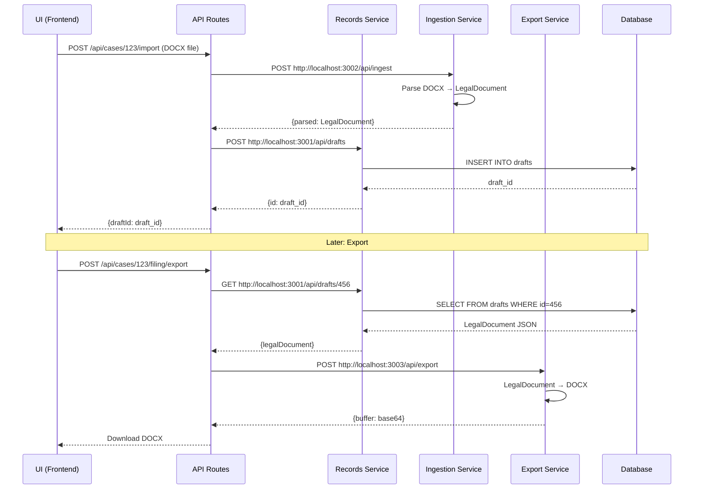

# Backend Architecture Diagrams

**Purpose:** Visual representations of current vs target architecture

---

## Current Architecture (Before)

**Problems:**
- ❌ Python as separate HTTP service (overhead)
- ❌ Monolithic pipeline (can't scale parts independently)
- ❌ No service isolation
- ❌ Single deployment model only

---

## Target Architecture (After - Desktop)

**Benefits:**
- ✅ Services as child processes (no Docker on desktop)
- ✅ Independent scaling in cloud
- ✅ PID management prevents zombies
- ✅ Health checks + auto-restart
- ✅ Service discovery via environment variables

---

## Service Communication Flow

