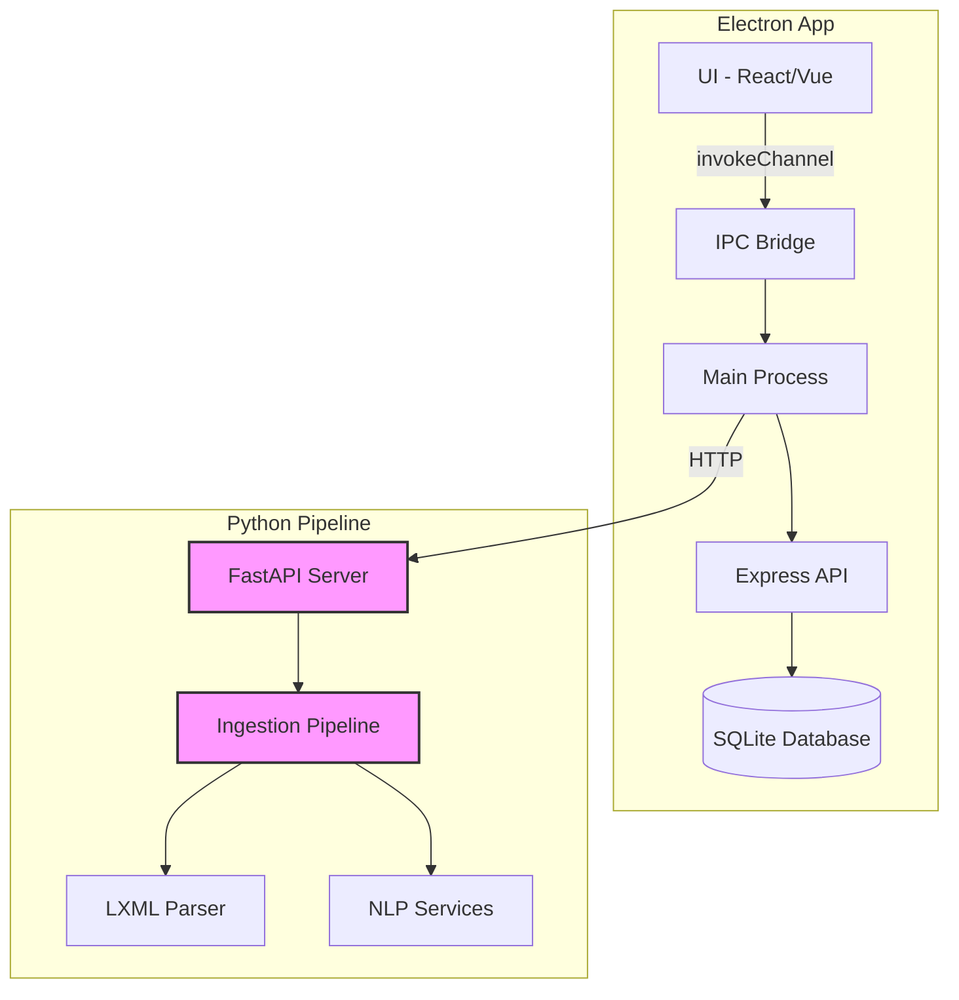
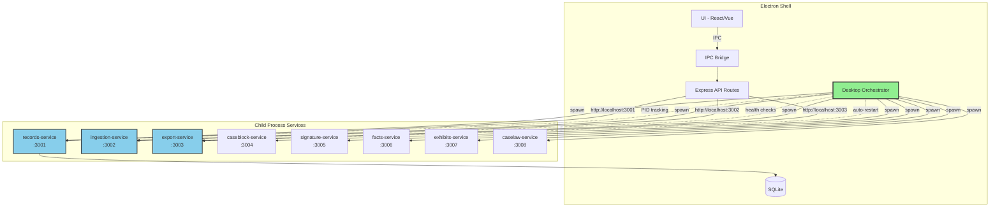
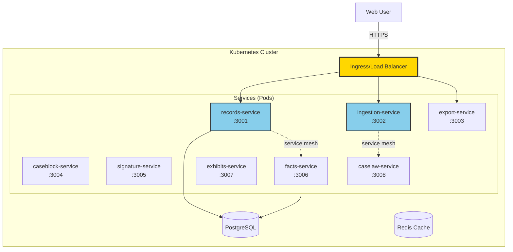
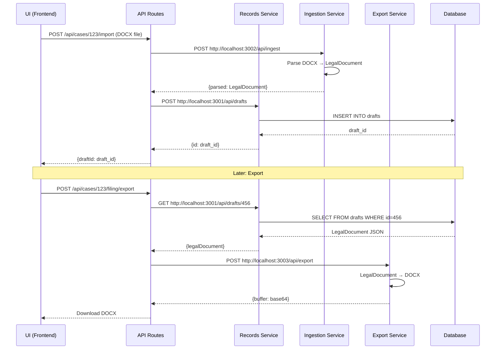

# BACKEND ARCHITECTURE AUDIT - Part 3: Visual Comparison & Drift Prevention

**Repository:** factsway-backend  
**Purpose:** Create side-by-side comparisons, visual diagrams, and progress tracking matrices  
**Input:** Parts 1 (Current) + 2 (Target)  
**Output:** Mermaid diagrams, comparison tables, implementation progress tracker

---

## Part 3A: Side-by-Side Architecture Comparison

### Output File: `/tmp/backend-architecture-comparison.md`

```bash
#!/bin/bash

OUTPUT="/tmp/backend-architecture-comparison.md"

cat > "$OUTPUT" << 'HEADER'
# Architecture Comparison: Current vs Target

**Purpose:** Visual comparison to prevent drift during implementation

---

## Directory Structure Comparison

### Current Structure (Before)

```
factsway-backend/
├── src/                              # 🟢 Electron app (stays)
│   ├── main/                         # 🟢 Main process
│   ├── api/                          # 🟡 API routes (update calls)
│   └── services/                     # 🟢 Storage services
├── factsway-ingestion/               # 🔴 OLD pipeline (refactor)
│   ├── ingestion_engine/
│   └── app.py                        # 🔴 DELETE
├── migrations/                       # 🟢 Database (keep)
├── vault/                            # 🟢 Documents (keep)
└── package.json
```

### Target Structure (After)

```
factsway-platform/                    # 🔵 NEW monorepo
├── services/                         # 🔵 NEW microservices
│   ├── records-service/              # 🔵 NEW
│   ├── ingestion-service/            # 🔵 NEW (from old pipeline)
│   ├── export-service/               # 🔵 NEW
│   ├── caseblock-service/            # 🔵 NEW
│   ├── signature-service/            # 🔵 NEW
│   ├── facts-service/                # 🔵 NEW
│   ├── exhibits-service/             # 🔵 NEW
│   └── caselaw-service/              # 🔵 NEW
├── apps/
│   └── desktop/                      # 🟡 MOVED from src/
│       ├── src/main/                 # 🟢 Electron (keep)
│       ├── src/api/                  # 🟡 Routes (update)
│       ├── migrations/               # 🟢 Database (keep)
│       └── vault/                    # 🟢 Documents (keep)
├── packages/                         # 🔵 NEW shared code
│   ├── shared-types/
│   └── shared-utils/
└── infrastructure/                   # 🔵 NEW deployment configs
```

---

## Component Count Comparison

HEADER

echo "| Category | Current | Target | Change |" >> "$OUTPUT"
echo "|----------|---------|--------|--------|" >> "$OUTPUT"

cat >> "$OUTPUT" << 'COUNTS'
| TypeScript Services | 0 | 1 (records) | +1 NEW |
| Python Services | 1 (monolith) | 7 (microservices) | +6 NEW |
| Electron Components | 3 (main, preload, handlers) | 4 (+ orchestrator) | +1 NEW |
| API Route Files | ~8 | ~8 | SAME (updated calls) |
| Database Schemas | 1 (SQLite) | 1 (SQLite) | SAME |
| Deployment Targets | 1 (Desktop only) | 4 (Desktop, Web, Mobile, Enterprise) | +3 NEW |
COUNTS

cat >> "$OUTPUT" << 'FOOTER'

---

## Critical Changes Summary

### 🟢 STAYS UNCHANGED (Core Backend)

**Electron App:**
- ✅ `src/main/index.ts` - Main process entry (moves to apps/desktop)
- ✅ `src/main/preload.ts` - IPC bridge (moves to apps/desktop)
- ✅ `src/main/handlers/` - All IPC handlers (moves to apps/desktop)
- ✅ Database schema in `migrations/`
- ✅ Document storage in `vault/`
- ✅ Storage services (`src/main/services/`)

**Database:**
- ✅ SQLite for desktop deployment
- ✅ All existing migrations
- ✅ Schema remains compatible

**UI Integration:**
- ✅ All IPC channels stay the same
- ✅ No breaking changes to frontend adapter

---

### 🔴 REMOVED (Old Ingestion)

**Python Monolith:**
- ❌ `factsway-ingestion/app.py` - FastAPI server (DELETE)
- ❌ Direct Python API calls from Electron (REPLACE with service calls)
- ❌ Monolithic pipeline (REFACTOR into ingestion-service)

**Reason:** Old pipeline becomes `ingestion-service`, but ingestion logic is preserved and improved.

---

### 🔵 ADDED (New Components)

**Microservices (8 total):**
1. ✨ `services/records-service/` - TypeScript/Node, port 3001
2. ✨ `services/ingestion-service/` - Python/FastAPI, port 3002
3. ✨ `services/export-service/` - Python/FastAPI, port 3003
4. ✨ `services/caseblock-service/` - Python/FastAPI, port 3004
5. ✨ `services/signature-service/` - Python/FastAPI, port 3005
6. ✨ `services/facts-service/` - Python/FastAPI, port 3006
7. ✨ `services/exhibits-service/` - Python/FastAPI, port 3007
8. ✨ `services/caselaw-service/` - Python/FastAPI, port 3008

**Desktop Orchestrator:**
- ✨ `apps/desktop/src/main/orchestrator.ts` - Spawns/manages services as child processes
- ✨ PID tracking, health checks, auto-restart
- ✨ Service discovery via environment variables

**Shared Packages:**
- ✨ `packages/shared-types/` - Common TypeScript types
- ✨ `packages/shared-utils/` - Shared utilities

**Infrastructure:**
- ✨ `infrastructure/kubernetes/` - Cloud deployment configs
- ✨ `infrastructure/docker-compose.yml` - Local testing

---

### 🟡 MODIFIED (Updated)

**API Routes:**
- 🔧 Update to call microservices instead of direct DB/Python
- 🔧 Example: `POST /api/cases/:id/filing/export` now calls `export-service:3003`
- 🔧 Service URLs injected via environment variables

**Package.json:**
- 🔧 Becomes workspace root (lerna/npm workspaces)
- 🔧 Scripts updated for monorepo
- 🔧 Dependencies moved to service-specific package.json files

FOOTER

echo "" >> "$OUTPUT"
echo "Comparison complete: $OUTPUT"
```

---

## Part 3B: Mermaid Architecture Diagrams

### Output File: `/tmp/backend-architecture-diagrams.md`

```bash
#!/bin/bash

OUTPUT="/tmp/backend-architecture-diagrams.md"

cat > "$OUTPUT" << 'HEADER'
# Backend Architecture Diagrams

**Purpose:** Visual representations of current vs target architecture

---

## Current Architecture (Before)



**Problems:**
- ❌ Python as separate HTTP service (overhead)
- ❌ Monolithic pipeline (can't scale parts independently)
- ❌ No service isolation
- ❌ Single deployment model only

---

## Target Architecture (After - Desktop)



**Benefits:**
- ✅ Services as child processes (no Docker on desktop)
- ✅ Independent scaling in cloud
- ✅ PID management prevents zombies
- ✅ Health checks + auto-restart
- ✅ Service discovery via environment variables

---

## Target Architecture (After - Cloud)



**Key Differences from Desktop:**
- 🔧 Docker containers instead of child processes
- 🔧 Kubernetes DNS instead of localhost
- 🔧 PostgreSQL instead of SQLite
- 🔧 Horizontal scaling (multiple replicas)
- 🔧 Load balancing

**Same Service Code:**
- ✅ Services use environment variables for discovery
- ✅ `RECORDS_SERVICE_URL=http://records-service:3001` (cloud)
- ✅ `RECORDS_SERVICE_URL=http://localhost:3001` (desktop)

---

## Service Communication Flow



**Environment Variable Injection:**
```typescript
// API Routes read these (set by orchestrator):
const RECORDS_URL = process.env.RECORDS_SERVICE_URL;  // http://localhost:3001
const INGEST_URL = process.env.INGESTION_SERVICE_URL; // http://localhost:3002
const EXPORT_URL = process.env.EXPORT_SERVICE_URL;    // http://localhost:3003
```

HEADER

echo "" >> "$OUTPUT"
echo "Diagrams complete: $OUTPUT"
```

---

## Part 3C: Implementation Progress Tracker

### Output File: `/tmp/backend-implementation-tracker.md`

```bash
#!/bin/bash

OUTPUT="/tmp/backend-implementation-tracker.md"

cat > "$OUTPUT" << 'HEADER'
# Implementation Progress Tracker

**Purpose:** Track completion of Runbook 0 implementation

---

## Runbook Implementation Status

HEADER

echo "| Runbook | Component | Status | Blocker | Verification |" >> "$OUTPUT"
echo "|---------|-----------|--------|---------|--------------|" >> "$OUTPUT"

cat >> "$OUTPUT" << 'TRACKER'
| RB-01 | Reference Document | ⏳ NOT STARTED | None | Document created |
| RB-02 | Database Schema | ⏳ NOT STARTED | RB-01 | Migrations run |
| RB-03 | Records Service | ⏳ NOT STARTED | RB-02 | Service starts on :3001 |
| RB-04 | Ingestion Service | ⏳ NOT STARTED | RB-02 | Service starts on :3002 |
| RB-05 | Export Service | ⏳ NOT STARTED | RB-04 | Service starts on :3003 |
| RB-06 | Specialized Services | ⏳ NOT STARTED | RB-04 | All 4 services start |
| RB-07 | Desktop Orchestrator | ⏳ NOT STARTED | RB-03 | Spawns all services |
| RB-08 | Frontend UI | ⏳ NOT STARTED | RB-07 | Import/export work |
| RB-09 | Service Discovery | ⏳ NOT STARTED | RB-07 | Env vars injected |
| RB-10 | Desktop Packaging | ⏳ NOT STARTED | RB-09 | Installer builds |
| RB-11 | Web Trial | ⏳ NOT STARTED | RB-05 | Web app deploys |
| RB-12 | Mobile Integration | ⏳ NOT STARTED | RB-11 | Mobile app connects |
| RB-13 | Enterprise Deployment | ⏳ NOT STARTED | RB-10 | K8s deploys |
| RB-14 | Evidence System | ⏳ NOT STARTED | RB-06 | Facts service works |
| RB-15 | Integration Testing | ⏳ NOT STARTED | RB-14 | All tests pass |
TRACKER

cat >> "$OUTPUT" << 'FOOTER'

**Legend:**
- ⏳ NOT STARTED - Not yet begun
- 🚧 IN PROGRESS - Currently working on
- ✅ COMPLETE - Verified and working
- ❌ BLOCKED - Cannot proceed

---

## Service Creation Checklist

### Records Service (Runbook 3)

- [ ] Directory created: `services/records-service/`
- [ ] package.json with dependencies
- [ ] src/server.ts (Express app)
- [ ] src/routes/templates.ts
- [ ] src/routes/cases.ts
- [ ] src/routes/drafts.ts
- [ ] src/repositories/sqlite/
- [ ] tests/ with integration tests
- [ ] Dockerfile for cloud deployment
- [ ] build.js for desktop bundling (pkg)
- [ ] Service starts on port 3001 ✓
- [ ] Health endpoint responds ✓
- [ ] CRUD operations work ✓

### Ingestion Service (Runbook 4)

- [ ] Directory created: `services/ingestion-service/`
- [ ] requirements.txt with dependencies
- [ ] app/main.py (FastAPI app)
- [ ] app/routes/ingest.py
- [ ] app/parsers/ (LXML logic from old pipeline)
- [ ] app/models/legal_document.py
- [ ] tests/ with pytest
- [ ] Dockerfile for cloud deployment
- [ ] build.spec for desktop bundling (PyInstaller)
- [ ] Service starts on port 3002 ✓
- [ ] /api/ingest endpoint works ✓
- [ ] LegalDocument JSON output matches schema ✓

### Export Service (Runbook 5)

- [ ] Directory created: `services/export-service/`
- [ ] requirements.txt with dependencies
- [ ] app/main.py (FastAPI app)
- [ ] app/routes/export.py
- [ ] app/renderers/docx_renderer.py
- [ ] app/renderers/pdf_renderer.py
- [ ] tests/ with pytest
- [ ] Dockerfile for cloud deployment
- [ ] build.spec for desktop bundling
- [ ] Service starts on port 3003 ✓
- [ ] /api/export endpoint works ✓
- [ ] DOCX preserves formatting ✓
- [ ] PDF generation works ✓

### Desktop Orchestrator (Runbook 7)

- [ ] File created: `apps/desktop/src/main/orchestrator.ts`
- [ ] DesktopOrchestrator class implemented
- [ ] startAllServices() method
- [ ] stopAllServices() method
- [ ] healthCheck() method
- [ ] cleanupZombies() method
- [ ] PID tracking (service-pids.json)
- [ ] Environment variable injection
- [ ] Auto-restart on crash
- [ ] Integration with main process
- [ ] All 8 services spawn successfully ✓
- [ ] Health checks run every 30s ✓
- [ ] Graceful shutdown on app quit ✓

---

## Critical Path Items

**Must complete in order:**

1. ✅ **Runbook 0** - Specification complete (DONE)
2. ⏳ **Runbook 1** - Reference document
3. ⏳ **Runbook 2** - Database schema
4. ⏳ **Runbook 3** - Records service (FIRST service)
5. ⏳ **Runbook 4** - Ingestion service (FIRST Python service)
6. ⏳ **Runbook 7** - Desktop orchestrator (CRITICAL)
7. ⏳ **Runbook 5** - Export service
8. ⏳ **Runbook 6** - Specialized services (4 services)
9. ⏳ **Runbook 8** - Frontend UI integration
10. ⏳ **Runbook 9** - Service discovery config
11. ⏳ **Runbook 10** - Desktop packaging

**Parallel tracks after RB-07:**
- Web/Mobile (RB-11, RB-12)
- Enterprise (RB-13)
- Evidence (RB-14)
- Testing (RB-15)

---

## Drift Prevention Checklist

**Before starting each runbook:**

- [ ] Re-read Runbook 0 relevant sections
- [ ] Check this architecture map for current state
- [ ] Verify no duplicate functionality exists
- [ ] Confirm IPC channels won't break
- [ ] Test service discovery works
- [ ] Run integration tests after changes

**During implementation:**

- [ ] Follow Runbook 0 specifications exactly
- [ ] No improvisation or "improvements"
- [ ] Document any deviations in journal
- [ ] Update this tracker after each task

**After completing runbook:**

- [ ] Update status in this tracker
- [ ] Verify all checklist items
- [ ] Run full test suite
- [ ] Commit with runbook reference
- [ ] Update architecture diagrams if needed

FOOTER

echo "" >> "$OUTPUT"
echo "Progress tracker complete: $OUTPUT"
```

---

## Part 3D: Drift Detection Script

### Output File: `/tmp/backend-drift-detector.sh`

```bash
#!/bin/bash

cat > /tmp/backend-drift-detector.sh << 'SCRIPT'
#!/bin/bash
# Drift Detection Script
# Run this periodically during implementation to catch architectural drift

cd /path/to/factsway-backend

echo "=== DRIFT DETECTION REPORT ==="
echo "Generated: $(date)"
echo ""

# Check 1: No duplicate ingestion code
echo "## Check 1: Duplicate Ingestion Detection"
echo ""

if [ -d "factsway-ingestion" ] && [ -d "services/ingestion-service" ]; then
  echo "⚠️ WARNING: Both old and new ingestion exist!"
  echo "   Old: factsway-ingestion/"
  echo "   New: services/ingestion-service/"
  echo "   Action: Verify migration complete, delete old"
else
  echo "✅ PASS: No duplicate ingestion code"
fi
echo ""

# Check 2: Services use environment variables (not hardcoded URLs)
echo "## Check 2: Service Discovery Pattern"
echo ""

hardcoded=$(grep -r "http://localhost:[0-9]" services --include="*.ts" --include="*.py" | grep -v "process.env" | wc -l | tr -d ' ')

if [ "$hardcoded" -gt 0 ]; then
  echo "❌ FAIL: Found $hardcoded hardcoded localhost URLs"
  grep -rn "http://localhost:[0-9]" services --include="*.ts" --include="*.py" | grep -v "process.env" | head -5
  echo "   Action: Replace with process.env.SERVICE_NAME_URL"
else
  echo "✅ PASS: All service URLs use environment variables"
fi
echo ""

# Check 3: No direct database access from API routes
echo "## Check 3: API Routes Use Services (Not Direct DB)"
echo ""

direct_db=$(grep -r "db\.\|database\." src/api/routes --include="*.ts" | grep -v "// " | wc -l | tr -d ' ')

if [ "$direct_db" -gt 3 ]; then
  echo "⚠️ WARNING: Found $direct_db potential direct DB accesses in API routes"
  echo "   Expected: API routes call services, services access DB"
  echo "   Action: Verify these are service calls, not direct DB"
else
  echo "✅ PASS: API routes appear to use services"
fi
echo ""

# Check 4: Desktop orchestrator exists if services exist
echo "## Check 4: Orchestrator Implementation Status"
echo ""

if [ -d "services" ]; then
  service_count=$(find services -maxdepth 1 -type d | wc -l | tr -d ' ')
  
  if [ ! -f "apps/desktop/src/main/orchestrator.ts" ] && [ ! -f "src/main/orchestrator.ts" ]; then
    echo "❌ FAIL: Services exist but no orchestrator found!"
    echo "   Services: $service_count"
    echo "   Action: Create DesktopOrchestrator (Runbook 7)"
  else
    echo "✅ PASS: Orchestrator exists"
  fi
else
  echo "✅ PASS: No services yet, orchestrator not needed"
fi
echo ""

# Check 5: IPC channels not broken
echo "## Check 5: IPC Channel Integrity"
echo ""

registered=$(grep -r "ipcMain.handle" src/main --include="*.ts" | wc -l | tr -d ' ')
invoked=$(grep -r "invokeChannel" src --include="*.ts" --include="*.tsx" | wc -l | tr -d ' ')

echo "   Registered handlers: $registered"
echo "   Invocations: $invoked"

if [ "$invoked" -gt "$registered" ]; then
  echo "⚠️ WARNING: More invocations than handlers (possible missing handlers)"
else
  echo "✅ PASS: Channel invocations <= registered handlers"
fi
echo ""

# Check 6: Monorepo structure (if supposed to be created)
echo "## Check 6: Monorepo Structure Check"
echo ""

if [ -f "lerna.json" ] || [ -f "pnpm-workspace.yaml" ]; then
  if [ ! -d "services" ]; then
    echo "⚠️ WARNING: Monorepo config exists but no services/ directory"
  elif [ ! -d "apps" ]; then
    echo "⚠️ WARNING: Monorepo config exists but no apps/ directory"
  else
    echo "✅ PASS: Monorepo structure looks correct"
  fi
else
  echo "ℹ️ INFO: Not yet using monorepo structure"
fi
echo ""

echo "=== END DRIFT DETECTION ==="
echo ""
echo "Run this script periodically during implementation to catch drift early"

SCRIPT

chmod +x /tmp/backend-drift-detector.sh

echo "Drift detector created: /tmp/backend-drift-detector.sh"
```

---

## Execution Instructions

**Run Part 3 after Parts 1 & 2:**

```bash
# Part 3A: Side-by-side comparison
bash /path/to/part-3a-comparison.sh

# Part 3B: Mermaid diagrams
bash /path/to/part-3b-diagrams.sh

# Part 3C: Progress tracker
bash /path/to/part-3c-tracker.sh

# Part 3D: Drift detector (run periodically)
bash /tmp/backend-drift-detector.sh

# Combine outputs
cat /tmp/backend-architecture-comparison.md \
    /tmp/backend-architecture-diagrams.md \
    /tmp/backend-implementation-tracker.md \
    > /tmp/BACKEND_COMPARISON_AND_TRACKING.md

echo "✅ Comparison and tracking complete!"
echo "📄 Output: /tmp/BACKEND_COMPARISON_AND_TRACKING.md"
```

---

## Expected Outputs

After Part 3, you will have:

1. **Side-by-side comparison** - Current vs Target directory structures
2. **Component count matrix** - What's added/removed/modified
3. **Mermaid diagrams** - Visual architecture (current, desktop target, cloud target)
4. **Service communication flow** - Sequence diagram
5. **Implementation tracker** - Progress checklist for all 15 runbooks
6. **Service creation checklists** - Task lists for each service
7. **Drift detection script** - Automated checks to run during implementation

**File size estimate:** ~800-1200 lines

**Usage:** Reference these during implementation to stay aligned with Runbook 0

---

## How to Use During Implementation

**Before starting any runbook:**
1. Review relevant sections in comparison document
2. Check current state in architecture map
3. Verify no duplicate functionality

**During implementation:**
1. Follow Runbook 0 specifications exactly
2. Run drift detector after major changes
3. Update progress tracker

**After completing runbook:**
1. Verify all checklist items complete
2. Run drift detector (should pass)
3. Update tracker status
4. Commit with runbook reference

---

## Notes

- These are VISUAL GUIDES, not executable code
- Use Mermaid diagrams in documentation
- Update tracker as you progress
- Run drift detector frequently
- Keep comparison doc open during implementation
